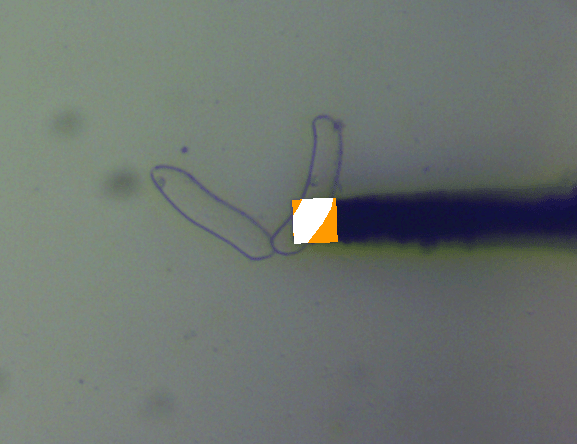

# microindentScript

 

  
  

    <b> Figure 1: </b>
    <i> A
      <a href="https://en.wikipedia.org/wiki/Indentation_hardness#Microindentation_tests">microindentation</a>
      image processed with the macro.
    </i>
  

## About the Project

Back in early 2020, I pursued my interests in material science by joining a research project. One major issue was processing vast amounts of images of different plant cells. 

Before, different group members needed to individually open and collect data on different cells from each image. The process of getting data from each image was fairly consistent, and included things like:
- Collecting length and width measurements
- Collecting area measurements from before and after indentation
- Converting these measurements to appropriate SI units
- Condensing and/or keeping track of data in large excel spreadsheets

Repeating these tasks for many images is tedious, time-consuming, and vulnerable to human error. My task was to create a script to help automate the process and thereby make it faster and easier. To do this, I used a scripting language that was built-in to a ImageJ, which is a common software for scientific image-processing. You can learn more about ImageJ [here.][1]

## Features
- Collects and condenses data into CSV files for later use.
- Organizes into separate directories for easy organization.
- Automatically loads images indentend/non-indented cells for processing

## Installation
1. Install ImageJ (the [Fiji][2] package is recommended)
2. Download the [macro.][3]
3. Open ImageJ's directory
4. Open the "plugins" folder, then open the "Scripts" folder.
5. Make a new folder and call it "Macros", or whatever is convenient for you.
6. Put the downloaded macro file into the folder you created in step 5.
7. If the ImageJ client is open, restart it.

Once you start ImageJ, you should notice the new drop-down menu with the same name as the folder that we created in step 4 (it will be next to the "Help" menu). Inside, you'll find the macro you placed in the folder from step 6. You can add new macros to this folder any time, and they'll appear the next time you open Fiji.

## Usage

Select the macro from the drop-down menu. From there, follow the instructions to begin collecting data from cell images.
<!-- You can read more about microindentation [here.][2] -->

## License

Distributed under the MIT License. See `LICENSE` for more information.

<!-- Markdown defintions -->
[example_1]: images/cell03_processed_cropped.png
[1]: https://fiji.sc/
[2]: https://en.wikipedia.org/wiki/Indentation_hardness#Microindentation_tests
[3]: src/AutoRecordRoum_.ijm
